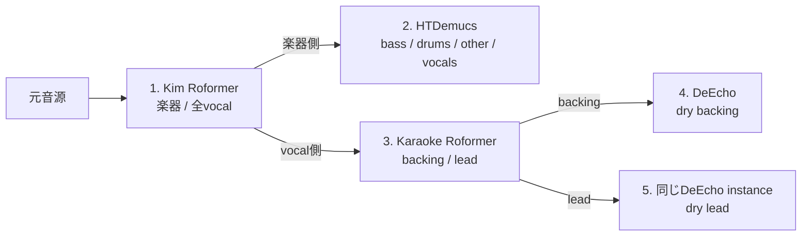

# MLX版と最適化済みMPS版の比較（2026-07-18）

## 結論（30秒版）

**速度では[MLX版](https://github.com/ssmall256/mlx-audio-separator)が優秀だった。** Apple M4 Proで実製品と同じ4モデル・5推論をつないだ34.44秒の分離チェーンは、最適化済みMPS版の34.470秒からMLX版の27.969秒へ **18.86%短縮（1.232倍）** した。process peak RSSの中央値も約2.99 GiBから約1.86 GiBへ下がった。

ただし、**元のPyTorch実装との数値的一致と、現在の製品へ安全に組み込める度合いはMPS版が明確に優れる。** CPU fp32をものさしにした最終dry vocalの波形差は、MPS版がbacking 0.268% / lead 0.0783%、MLX版がbacking 6.583% / lead 4.370%だった。

CPU fp32は正解のstemではないため、この数値だけで「MPS版のほうが聴感上高音質」とは断定できない。現時点の製品判断は次の通りである。

> **MPS版を本番の既定として維持する。MLX版はfeature flag付きの候補とし、実製品E2E計測とblind聴感確認を通してから切り替えを判断する。**

| 観点 | 優位 | 根拠 |
|---|---|---|
| 分離処理時間 | MLX | 34.44秒チェーンを18.86%短縮 |
| process peak RSS | MLX | 中央値が約37.79%小さい |
| PyTorch fp32との波形一致 | MPS | モデル単体10 stemの最大差0.213%、MLXは38.791% |
| 現製品への組み込み | MPS | MLXは返却順・path・設定・model再利用のadapterが必要 |
| 推論時の依存 | MLX | 変換済みweightならPyTorch / ONNX Runtime不要という設計 |
| 現時点の本番既定 | MPS | MLXの音楽的品質と製品E2Eが未検証 |

機械可読な集計値、入力・modelのSHA-256、全桁の測定値は [`results/mlx-vs-mps-2026-07-18.json`](results/mlx-vs-mps-2026-07-18.json) に保存した。

## そもそもMPS版とMLX版は何が違うか

- **MPS版**: 元の`python-audio-separator`をPyTorchで動かし、Apple GPUへ処理を渡す。本branchではPyTorch 2.13、不要なchunk推論の除去、native fp16、model再利用、長尺向けcompileなどを追加した。
- **MLX版**: 同じ種類の学習済みmodelを、Apple Silicon向けframeworkであるMLXへ移植した別実装で動かす。

MPS側で何を最適化したかの詳細は [`mps-2026-07-13.md`](mps-2026-07-13.md) にまとめている。

Web開発にたとえると、**同じデータと仕様を、別のruntimeへportした状態**に近い。同じcheckpointを変換して使っても、行列演算、FFT、padding、丸めなどの細部が違えば、返る波形が完全に同じになるとは限らない。

今回比べているのは学習ではなく**推論**である。既に学習済みのweightを読み込み、音源をstemへ分ける実行部分だけを測った。

## 実製品相当の分離チェーン

実製品の `separation_pipeline.py` から4モデルと設定を読み取り、次の5推論を再現した。DeEchoはbackingとleadへ1回ずつ使う。



主な設定は両backendでそろえた。

- MDXC: segment 1101、override有効、overlap 8、batch 1、pitch shift 0
- VR: window 320、aggression 50、batch 1、TTA有効、post process / high-end process無効
- Demucs: default segment、shifts 2、overlap 0.25、segments有効、batch 1
- normalization 1.0、amplification 0.0、seed 0
- MPS: `use_autocast=True`、主比較では`use_torch_compile=False`
- MLX: `speed_mode=default`、aggressive cache clear、writer 1、変換済みweight

Demucsだけは配布形式が異なり、MPS側は`955717e8-8726e21a.th`、MLXのconverterはHugging Face上の`955717e8.safetensors`を読む。両方をPyTorch tensorとして展開して比較すると、533 keyの集合、dtype、shape、全tensor値がbit単位で一致し、最大絶対差は0だった。したがってfile hashは違うが、推論に使うlogical weightは同じである。

## 比較条件と測定範囲

| 項目 | 値 |
|---|---|
| Mac | MacBook Pro Mac16,8、Apple M4 Pro、12-core、Unified Memory 24 GB |
| OS | macOS 15.3.1 arm64 |
| Python | 3.12.3 |
| MPS側 | `audio-separator` 0.41.1、PyTorch 2.13.0、revision `046447c` |
| MLX側 | `mlx-audio-separator` 0.1.5、MLX 0.31.2、revision `0ddc8cf` |
| 出力 | WAV、44.1 kHz、stereo |
| 主入力 | `oresama-pirates.wav`の20.00〜54.44秒、34.44秒 |
| 品質入力 | `LifeLight.wav`の60.00〜94.44秒、34.44秒 |

測定境界では、MPSは`torch.mps.synchronize()`、MLXは`mx.synchronize()`を呼び、非同期GPU処理を完了させてから時計を止めた。計測対象は各libraryのpublic `separate()`であり、decode、model推論、stemのWAV書き出しを含む。model loadは別timerとしたが、34.44秒チェーンの合計には含めた。

重要な限定がある。

- 「製品相当」とは**modelの分離連鎖と推論設定**を指す。製品のpydub無音解析、stem overlay、最終m4a export、API overheadは含まない。
- WAVへ統一したため、製品endpoint全体の応答時間ではない。
- MPSとMLXのbackend固有memory allocator値は意味が違う。memory比較には共通のOS指標であるprocess peak RSSだけを使った。
- MLXの主条件では、MPS版のmodel再利用と条件をそろえるため、2回目のDeEchoでadapterが`load_model()`を省略した。省略しない条件も別途測った。
- 各runはfresh processで、MPS → MLX → MLX → MPS → MPS → MLXのbalanced ABBAAB順に実行した。順序自体はrandomizedせず、OSのfile cacheや温度を完全には統制していない。主結果では3回の実測範囲が重ならないことも確認した。

## 速度結果

### 主結果: 34.44秒の依存チェーン

backendごとにfresh processを3回起動し、load、5推論、各段のWAV I/Oを含む合計の中央値を採った。範囲にも重なりがなく、この音源では3回ともMLX版が速かった。

| backend | 3回の実測 | 中央値 | realtime factor |
|---|---|---:|---:|
| 最適化済みMPS | 34.091 / 35.049 / 34.470秒 | **34.470秒** | 1.001 |
| MLX | 27.969 / 27.352 / 28.376秒 | **27.969秒** | 0.812 |
| **MLXの差** |  | **-6.501秒、-18.86%** | **1.232倍** |

`realtime factor`は処理時間 ÷ 音源時間である。1.0なら34.44秒の音源に約34.44秒かかり、0.812なら音源の長さの約81%で終わる。

各stageの`load + separate()`をrunごとに合算してから取った中央値は次の通り。stageごとに中央値となるrunが違うため、行の合計は上のchain中央値とは一致しない。

| stage | MPS | MLX | MLXの差 |
|---|---:|---:|---:|
| Kim Roformer | 10.165秒 | 5.253秒 | -48.32% |
| HTDemucs | 4.710秒 | 3.279秒 | -30.38% |
| Karaoke Roformer | 8.954秒 | 5.213秒 | -41.78% |
| DeEcho / backing | 5.664秒 | 6.966秒 | **+22.98%** |
| DeEcho / lead | 5.155秒 | 6.957秒 | **+34.97%** |

MLXはRoformer 2モデルとDemucsで稼ぎ、DeEchoで一部を失っている。それでもchain全体では勝った。

### 15秒・model単体のwarm推論

各modelを別processでloadし、warm-up 1回後の3回の`separate()`中央値を比較した。load時間は含まない。

| model / 製品での回数 | MPS | MLX | 結果 |
|---|---:|---:|---:|
| Kim Roformer ×1 | 4.174秒 | 2.723秒 | MLX 34.76%短縮、1.533倍 |
| HTDemucs ×1 | 2.660秒 | 1.516秒 | MLX 43.01%短縮、1.755倍 |
| Karaoke Roformer ×1 | 4.260秒 | 2.646秒 | MLX 37.88%短縮、1.610倍 |
| DeEcho ×1 | 2.605秒 | 3.481秒 | **MLX 33.62%増加** |
| **製品5推論換算** | **16.305秒** | **13.848秒** | **MLX 15.07%短縮、1.177倍** |

5推論換算は4つの個別中央値を `Kim + Demucs + Karaoke + 2 × DeEcho` で足した参考値である。段の出力を次段へ渡す主結果は、前節の34.44秒チェーンを優先する。

参考として、MPS regional compileのwarm中央値はKim 3.108秒、Karaoke 3.029秒まで下がった。ただし最初のwarm-upは7.444秒 / 5.656秒かかる。34.44秒chainをempty compile cacheから実行した1回は35.229秒で、eager中央値より2.20%遅かった。短尺でcompileを既定にしない従来判断は変わらない。

### 229.18秒・Roformer 2モデル

`LifeLight.wav`全体を使い、KimとKaraokeをそれぞれfresh processで1回実行した。どちらにも同じ元音源を入力した2つのmodel単体結果の和であり、製品chainではない。MPS compileはmodelごとに別のempty Inductor cacheから開始し、MLXは事前変換済みweightを使った。

| 条件 | 2モデルの推論合計 | MLXとの差 |
|---|---:|---:|
| MPS eager | 116.125秒 | MLXが34.17%短縮、1.519倍 |
| MPS cold regional compile | 93.169秒 | MLXが17.95%短縮、1.219倍 |
| **MLX** | **76.440秒** | — |

load込みでは、MPS eager 119.106秒、MPS cold compile 96.784秒、MLX 76.500秒だった。ただし各条件1回なので、短い主比較ほどの分散情報はない。

### memory

34.44秒チェーンのprocess peak RSS中央値は次の通り。

| backend | peak RSS中央値 |
|---|---:|
| MPS | 2.988 GiB |
| MLX | 1.859 GiB |
| 差 | **MLXが37.79%小さい** |

`ru_maxrss`はprocess開始後の最大値なので、瞬間ごとのGPU専用memoryではない。Apple SiliconのUnified Memory環境で、同じOS指標を使った目安として読む。

## MLXの初回変換コスト

MLXは元の`.ckpt` / `.pth` / Demucs weightを一度MLX用artifactへ変換できる。元weightがlocalに揃った状態で、fresh cacheから変換と保存を各1回測った。network downloadは含まない。

| model | 変換 + 保存 | 追加artifact |
|---|---:|---:|
| Kim | 0.773秒 | 912,889,223 bytes |
| HTDemucs | 1.290秒 | 167,970,868 bytes |
| Karaoke | 0.789秒 | 912,889,223 bytes |
| DeEcho | 0.546秒 | 223,450,072 bytes |
| **合計** | **3.398秒** | **2.065 GiB** |

今回のSSD cacheでは変換時間は小さく、steady-state loadは各model約0.03〜0.07秒だった。MLXはlazy load / mmapを使うため、weightの実体化の一部は最初の`separate()`にも含まれる。したがってload timerだけで優劣を判断せず、主結果のload込みchainを見るべきである。

推論専用環境は変換済みartifactを配布すればPyTorch / ONNX Runtimeなしで構成できる、というのがMLX版の利点である。一方、初回変換を実行する環境にはconversion extrasが必要になる。

## 出力の一致度

### この節でいう「品質」の意味

ここでいう品質は、**正解stemに近いかではなく、元PyTorch実装の高精度計算と同じ波形を返すか**という移植リスクの指標である。聴感上の優劣を確定するものではない。

CPU fp32は、速度より計算精度を優先して、元のPyTorch実装をCPUの32-bit floatで動かした「数値上のものさし」である。内部推論はfp32だが、比較した公開出力は全backendとも同じPCM 16-bit WAV経路で書き出している。教師データや正解の歌声stemではない。

- **relative L2**: 波形全体のズレの大きさ ÷ 基準波形全体の大きさ。0%なら同一。ほぼ無音のstemは分母が小さくなり、割合が大きく見えやすい。
- **SNR**: 基準信号と差分の比。大きいほど一致する。relative L2との対応は、おおよそ20 dB = 10%、40 dB = 1%、60 dB = 0.1%である。
- **correlation**: 波形の形の似方。1に近いほど似ているが、振幅差を単独では十分に表さない。

### 4モデルを同じ入力で個別比較

`LifeLight.wav`の34.44秒区間を各modelへ直接入力し、全10 stemをCPU fp32と比較した。全出力でsample rate、channel数、shapeが一致し、NaN / Infはなかった。表は各model内の最小SNRと最大relative L2、つまりworst caseである。

| model | MPS 最小SNR | MPS 最大差 | MLX 最小SNR | MLX 最大差 |
|---|---:|---:|---:|---:|
| Kim | 63.81 dB | 0.0645% | 24.53 dB | 5.937% |
| HTDemucs | 53.42 dB | 0.2134% | 11.74 dB | 25.871% |
| Karaoke | 64.21 dB | 0.0616% | 25.92 dB | 5.056% |
| DeEcho | 58.41 dB | 0.1201% | 8.23 dB | 38.791% |
| **全10 stem worst** | **53.42 dB** | **0.2134%** | **8.23 dB** | **38.791%** |

MLX版READMEのparity smokeで使われているrelative L2 5%を参考線として今回のstemへ当てると、5%を超えたのはMPS 0/10、MLX 5/10だった。これはREADMEの4モデルに対するrelease gateを、今回の全modelへそのまま保証するものではない。

差が特に大きいのはMLX版のDeEcho reverb（38.791%）とDemucs drums（25.871%）だった。MPS対MLXの直接比較もほぼ同じ値になり、MPS版がCPU fp32へ近く、MLX版の実装差が波形へ現れていることを確認した。

### 依存チェーンの最終dry vocal

同じ`LifeLight.wav`区間で5推論を実際につなぎ、製品が使うDeEcho後のdry backing / leadを比較した。

| 最終出力 | backend | relative L2 | SNR | correlation | MAE |
|---|---|---:|---:|---:|---:|
| backing dry | MPS | **0.268%** | 51.43 dB | 0.9999964 | 1.62e-5 |
| backing dry | MLX | **6.583%** | 23.63 dB | 0.9980182 | 4.30e-4 |
| lead dry | MPS | **0.0783%** | 62.13 dB | 0.9999997 | 2.29e-5 |
| lead dry | MLX | **4.370%** | 27.19 dB | 0.9990454 | 1.47e-3 |

全12中間stemでは5%を超えたものがMPS 0/12、MLX 8/12だった。ただしほぼ無音のDemucs vocalなどは割合が膨らむため、製品で直接使う上表のdry出力を主に見る。

この結果から言えるのは、**MPS版は元のPyTorch fp32実装を非常によく保ち、MLX版は今回のmodelで無視できない実装差がある**ことまでである。音楽的にどちらが正しいかを決めるには、実曲のblind聴感比較、または正解stemがあるdatasetでSDR / SI-SDRを測る必要がある。

## MLX版READMEの「1.847倍」と矛盾するか

矛盾しない。MLX版READMEのperformance snapshotは、M4 mini、MUSDB18-HQの12曲、今回とは別の4モデル、別の`audio-separator` baselineを使い、1.40〜2.50倍、4モデル中央値1.847倍としている。README自身も普遍的な保証ではないと限定している。

今回の実製品modelでは次の事情がある。

- Kim / Karaoke / DemucsはMLXが1.53〜1.75倍速い。
- 製品で2回使うDeEchoは、逆にMLXが1.34倍遅い。
- model load、WAV I/O、前段の実出力を次段へ渡す時間もchain合計に入る。

そのため、今回のchain全体では1.232倍に落ち着いた。公開benchmarkの数字を否定する結果ではなく、**実際に使うmodel構成で測る必要性を示す結果**である。

## 現製品へそのまま置換できるか

import先を変えるだけのdrop-in置換はできない。実機で次を確認した。

1. MLX版の`Separator`は、現製品が渡す`use_autocast=True`を受け付けない。
2. KimとKaraokeは2 stemの返却順がMPS版と逆で、Demucsもbass / drumsの順が異なる。
3. MLX版は絶対pathを返す。現製品の`output_dir.rglob(file_name)`はfilename前提なので、そのままでは解決できない。
4. 現MPS版は同名modelを連続`load_model()`したとき内部cacheを再利用する。MLX版ではadapterが2回目のDeEcho loadを省略する必要がある。
5. 最速のsteady-state運用には、約2.065 GiBの変換済みartifactを事前生成・配布する必要がある。

ベンチrunnerは`custom_output_names`を渡し、返却順ではなくfilenameでstemを対応付け、絶対 / 相対pathの両方を解決した。これは移行adapterの最小要件でもある。

2回目のDeEchoを省略せず、MLX版の現在の`load_model()`を毎回呼んだ3回の中央値は28.295秒だった。adapterありの27.969秒より1.16%遅いだけで、MPS版34.470秒に対してはなお17.91%速い。したがって再利用adapterは主結論を作り出した要因ではない。

`latency_safe_v3`、Demucs batch 8、deferred cache、writer 2を組み合わせた中央値は28.287秒で、主比較条件より1.14%遅かった。今回の製品chainでは`speed_mode=default`かつ製品とそろえたDemucs batch 1の主比較設定を採用する。

## 製品判断と次のgate

速度だけならMLXへ移る価値はある。しかし波形差の原因と聴感影響が未確認なので、いきなり本番既定を置き換える段階ではない。次の順で進めるのが妥当である。

1. backend adapterを実装し、引数差、絶対path、stem名対応、DeEcho再利用を吸収する。
2. feature flagでMPS / MLXを切り替え、問題時に即時rollbackできるようにする。
3. 製品のm4a、無音解析、overlay、final exportまで含むE2Eを同じ入力で測る。
4. 代表曲10〜20曲でblind A/BまたはABX聴感確認を行う。特にDeEcho後のvocalとDemucs drumsを重点確認する。
5. clean stemが利用できればSDR / SI-SDRを測り、「元実装との一致」ではなく「正解との近さ」を比較する。
6. 品質gateを通った場合だけ、canary運用からMLX比率を上げる。

未計測だが、MLXで速いKim / Demucs / KaraokeとMPSで速いDeEchoを組み合わせるhybrid構成も候補になる。ただし両runtime常駐によるmemory増加、backend間の中間WAV、運用複雑性を含めて別途実測が必要である。

## 再現情報

### 入力の出所

元音源は次のユーザー提供ディレクトリにある。

```text
/Users/excite2022/Downloads/youtube著作権テスト/1.ブラウザ録画録音/
```

| 入力 | 元file | 切り出し |
|---|---|---:|
| `oresama-15s.wav` | `oresama-pirates.wav` | 45.00〜60.00秒 |
| `oresama-34s.wav` | `oresama-pirates.wav` | 20.00〜54.44秒 |
| `lifelight-34s.wav` | `LifeLight.wav` | 60.00〜94.44秒 |
| 229.18秒入力 | `LifeLight.wav` | 全体 |

各入力とmodelの完全なSHA-256はmachine-readable aggregateへ記録した。Kim / Karaoke / DeEchoのcheckpointに加え、Demucsの`htdemucs.yaml`、MPS側`.th`、MLX変換元`.safetensors`の両方を含む。

### provenance

- MPS / MLX速度計測: benchmark JSONが記録したrevisionは`046447c7f3553cc1eef8a3b391f331391b38393f`。この時点のrunnerはdirty状態を記録しないため、revision以外は遡って断定しない。
- MLX移植repo: `0ddc8cf5507906b52ac45a9cd9e6d26e881a93f8`
- CPU fp32を含む品質計測と、Kim / Karaokeの変換保存計測: CPU backendと`--mlx-save-converted-safetensors`を追加したtracked diffを使用し、その経路を`35921bd35fe89762dfa218288bef97eac1a001a9`へcommitした。raw JSONのreporterはdirty状態を記録できず、HEADは`046447c`とだけ記録されている。追加diffは既存MPS / MLXの推論経路を変えない。

### 主比較コマンド

PyTorch 2.13、MLX版とconversion extrasを導入した同一Python環境を使う。`MODEL_DIR`は製品modelのcleanなcopyとし、MLX用artifactをそこへ事前生成する。Demucs artifactはMLX側の仕様に合わせ、隔離した`HOME`のcacheへ生成する。

```bash
export BENCH_PYTHON=/path/to/python3.12
export BENCH_ROOT="$HOME/.cache/audio-separator-mlx-comparison"
export BENCH_HOME="$BENCH_ROOT/home"
export SOURCE_DIR='/Users/excite2022/Downloads/youtube著作権テスト/1.ブラウザ録画録音'
export MODEL_DIR=/path/to/clean-copy-of-product-models
mkdir -p "$BENCH_ROOT/input" "$BENCH_ROOT/results" "$BENCH_ROOT/output" "$BENCH_HOME"

ffmpeg -y -i "$SOURCE_DIR/oresama-pirates.wav" -ss 45 -t 15 \
  -c:a pcm_s16le "$BENCH_ROOT/input/oresama-15s.wav"
ffmpeg -y -i "$SOURCE_DIR/oresama-pirates.wav" -ss 20 -t 34.44 \
  -c:a pcm_s16le "$BENCH_ROOT/input/oresama-34s.wav"
ffmpeg -y -i "$SOURCE_DIR/LifeLight.wav" -ss 60 -t 34.44 \
  -c:a pcm_s16le "$BENCH_ROOT/input/lifelight-34s.wav"

for model in kim demucs karaoke deecho; do
  HOME="$BENCH_HOME" "$BENCH_PYTHON" tools/benchmark_apple_backends.py \
    "$BENCH_ROOT/input/oresama-15s.wav" \
    --backend mlx --mode models --model "$model" \
    --model-dir "$MODEL_DIR" \
    --output-dir "$BENCH_ROOT/output/preconvert-$model" \
    --json-output "$BENCH_ROOT/results/preconvert-$model.json" \
    --warmup 0 --repeats 1 --seed 0 \
    --mlx-save-converted-safetensors
done

backends=(mps mlx mlx mps mps mlx)
runs=(1 1 2 2 3 3)
for index in "${!backends[@]}"; do
  backend="${backends[$index]}"
  run="${runs[$index]}"
  HOME="$BENCH_HOME" "$BENCH_PYTHON" tools/benchmark_apple_backends.py \
    "$BENCH_ROOT/input/oresama-34s.wav" \
    --backend "$backend" --mode chain \
    --model-dir "$MODEL_DIR" \
    --output-dir "$BENCH_ROOT/output/chain-$backend-$run" \
    --json-output "$BENCH_ROOT/results/chain-$backend-$run.json" \
    --warmup 0 --repeats 1 --seed 0 \
    --no-torch-compile \
    --mlx-speed-mode default \
    --mlx-cache-clear-policy aggressive \
    --mlx-write-workers 1 \
    --mlx-demucs-batch-size 1 \
    --mlx-deecho-reuse \
    --mdxc-segment-size 1101 --mdxc-overlap 8 \
    --vr-window-size 320 --vr-aggression 50 --vr-tta \
    --demucs-shifts 2 --demucs-overlap 0.25
done
```

品質比較では同じ入力を`--backend cpu`、`mps`、`mlx`で各1回生成し、CPUをreferenceにする。

```bash
for backend in cpu mps mlx; do
  HOME="$BENCH_HOME" "$BENCH_PYTHON" tools/benchmark_apple_backends.py \
    "$BENCH_ROOT/input/lifelight-34s.wav" \
    --backend "$backend" --mode chain \
    --model-dir "$MODEL_DIR" \
    --output-dir "$BENCH_ROOT/output/quality-$backend" \
    --json-output "$BENCH_ROOT/results/quality-$backend.json" \
    --warmup 0 --repeats 1 --seed 0 \
    --no-torch-compile \
    --mlx-speed-mode default \
    --mlx-cache-clear-policy aggressive \
    --mlx-write-workers 1 \
    --mlx-demucs-batch-size 1 \
    --mlx-deecho-reuse \
    --mdxc-segment-size 1101 --mdxc-overlap 8 \
    --vr-window-size 320 --vr-aggression 50 --vr-tta \
    --demucs-shifts 2 --demucs-overlap 0.25
done

"$BENCH_PYTHON" tools/compare_stem_outputs.py \
  --reference "$BENCH_ROOT/output/quality-cpu/cpu/chain/run-1" \
  --candidate "$BENCH_ROOT/output/quality-mps/mps/chain/run-1" \
  --json-output "$BENCH_ROOT/results/quality-cpu-vs-mps.json"

"$BENCH_PYTHON" tools/compare_stem_outputs.py \
  --reference "$BENCH_ROOT/output/quality-cpu/cpu/chain/run-1" \
  --candidate "$BENCH_ROOT/output/quality-mlx/mlx/chain/run-1" \
  --json-output "$BENCH_ROOT/results/quality-cpu-vs-mlx.json"
```

Demucsの2つの配布形式が同じlogical weightかは次の方法で再確認できる。

```bash
export DEMUCS_TH="$MODEL_DIR/955717e8-8726e21a.th"
export DEMUCS_SAFE="$(find "$BENCH_HOME/.cache/huggingface/hub/models--adefossez--HTDemucs/snapshots" \
  -name 955717e8.safetensors -print -quit)"

"$BENCH_PYTHON" - <<'PY'
import os
import torch
from safetensors.torch import load_file

legacy = torch.load(os.environ["DEMUCS_TH"], map_location="cpu", weights_only=False)["state"]
portable = load_file(os.environ["DEMUCS_SAFE"])
assert legacy.keys() == portable.keys()
for key, legacy_tensor in legacy.items():
    portable_tensor = portable[key]
    assert legacy_tensor.dtype == portable_tensor.dtype
    assert legacy_tensor.shape == portable_tensor.shape
    assert torch.equal(legacy_tensor, portable_tensor)
print(f"{len(legacy)} tensors: bit exact")
PY
```

## 検証

```text
pytest tests/unit
232 passed, 4 skipped, 4 warnings
```

warningは依存libraryのdeprecated APIに関する既知のもので、今回の変更とは無関係。実modelでは次を確認した。

- 4モデルすべてでMPS / MLXのwarm-up 1回 + 3計測を完走
- 34.44秒の依存chainをMPS / MLX各3 fresh processで完走
- 229.18秒のRoformer 2モデルをMPS eager / cold compile / MLXで完走
- MLXのfresh変換・保存を4モデルで完走
- 34.44秒の4モデル単体と依存chainをCPU fp32 / MPS / MLXで生成
- 比較対象の全fileがdecode可能、finite、sample rate / channels / shape一致
